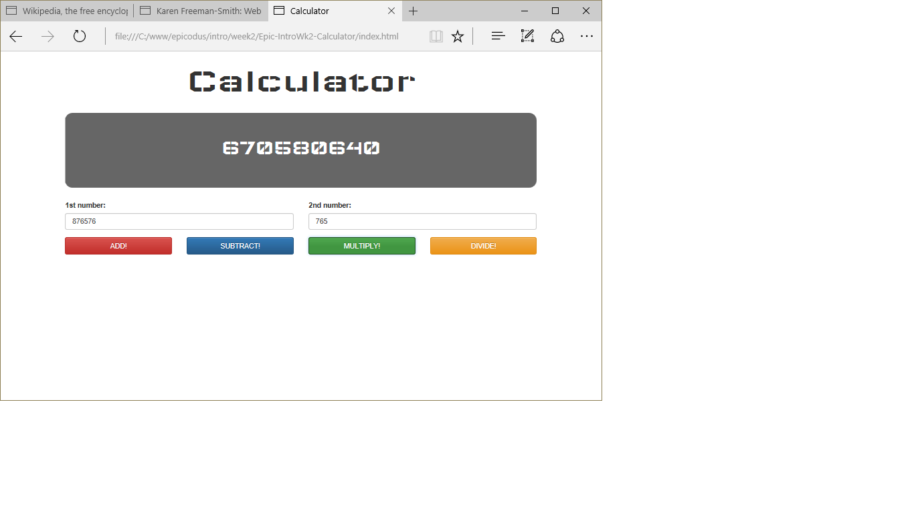

# JavaScript Calculator
Version 0.0.3: August 11, 2016
by [Karen Freeman-Smith](https://karenfreemansmith.github.io), [Brenda Farrier](https://github.com/brendapdx), [Adam Gorbahn](https://github.com/Pyrrus) and [Aimen Khakwani](http://aimenkhakwani.github.io)

### Technologies Used
HTML, CSS, Bootstrap, JavaScript, jQuery

## Description
*[Epicodus](http://epicodus.com) Intro to Programming Week 2 Pair Project with Brenda Farrier, Adam Gorbahn and Aimen Khakwani: Sample project to learn about writing functions and dividing frontend and backend concerns by creating a JavaScript calculator.*

## Setup/Installation
* [View on Github Pages](https://karenfreemansmith.github.io/Epic-IntroWk2-Calculator)
* _OR_
* Clone directory
* Open index.html in your favorite browser

## Support & Contact
For questions, concerns, or suggestions please email karenfreemansmith@gmail.com

## Known Issues
* None

## Legal
*Licensed under the GNU General Public License v3.0*

Copyright (c) 2016 Copyright _[Karen Freeman-Smith](https://karenfreemansmith.github.io), [Brenda Farrier](https://github.com/brendapdx), [Adam Gorbahn](https://github.com/Pyrrus) and [Aimen Khakwani](http://aimenkhakwani.github.io)_ All Rights Reserved.
